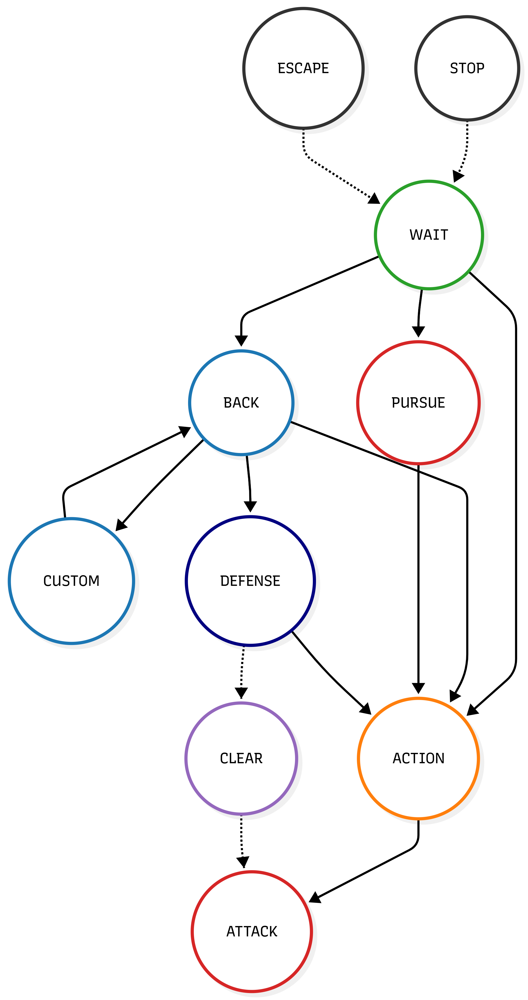

# Project 1: 1vs1 FSM (Deterministic Baseline)

## Project Scope
This module represents the fundamental basis of the entire simulation environment. The goal is to develop and validate the core architecture (physics engine, kinematic model, game rules) and create a deterministic "brain" based on a Finite State Machine (FSM) capable of autonomously playing a 1vs1 match. This agent serves as the baseline for evaluating the performance of the artificial intelligences developed in subsequent modules.

## Modeling and Collision Physics
The simulator is a 2D environment developed entirely in MATLAB, designed with an Object-Oriented approach.
- **Robot Kinematics:** The *Elisa-3* robots are *differential-drive* (non-holonomic) vehicles. To simplify directional control, the model is mathematically converted into a **unicycle** and controlled via **Input-Output Linearization**. By choosing a virtual point $B$ ahead of the center of mass, the Cartesian dynamics are decoupled, allowing the use of simple PID controllers.
- **Ball Physics and Collisions:** Interactions with the field boundaries are handled using **Artificial Potential Fields (APF)** repulsions and inelastic impulsive collision calculations. The robot is modeled with a dual *hitbox*: a central *passive circle* (the chassis) and a frontal *active circle* (the "kicker"), which imparts a greater impulse to the ball, also accounting for rotational inertia.

## The FSM Brain (Finite State Machine)
The decision-making core of the robot is encapsulated in the `Planner` class. Instead of executing mere local reactivity, the FSM constantly analyzes the position of the ball, the target, and the opponent to route the logical flow through different tactical chains:

1. **Wait and Routing Chain:**
   - `WAIT`: Rest and observation state.

2. **Offensive Chain:**
   - `PURSUE`: Geometric pursuit of the ball (positioning).
   - `ACTION`: Critical phase where the agent "aims," calculating the optimal trajectory to evade defensive blocks.
   - `ATTACK`: Physical execution of the accelerated impact.

3. **Defensive Chain:**
   - `BACK`: Rapid retreat towards its own half to recover positional disadvantage.
   - `CUSTOM`: Bypass maneuver dynamically generated via *via-points* to avoid dragging the ball into an own goal during the retreat.
   - `DEFENSE`: Shield coverage on the opponent's shooting line.
   - `CLEAR`: Emergency clearance if the ball gets too close to the critical zone.

4. **Emergency Overrides:**
   - `STOP`: "Freezes" the wheels if the ball is traveling at extremely high speeds.
   - `ESCAPE`: Breaks potential geometric stalls (deadlocks) with the ball or the opponent.

  
   
  <em>Topological graph of the Finite State Machine implemented in the Planner class.</em>

## Simulation Videos

**Video 1:**

https://github.com/user-attachments/assets/1ee0933f-d810-49fd-b70a-82b912f6ab6e

**Video 2:**

https://github.com/user-attachments/assets/679d1bf3-faf4-4f1d-bc3e-0f2fe6280e01

