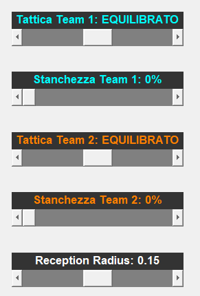
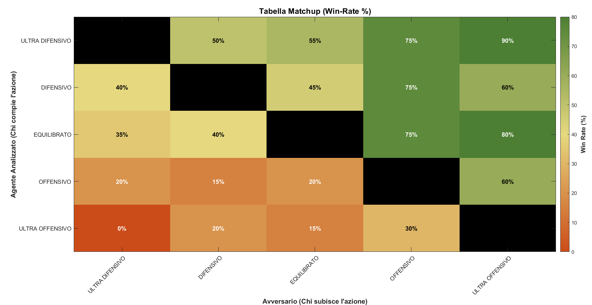

# Project 3: 2vs2 Multi-Agent Coordination

## Multi-Agent Logic: From 1vs1 to 2vs2
The transition from the individual to the cooperative scenario introduces a novel challenge: avoiding tactical overlap (interference between allies) and optimizing spatial coverage. Simply putting two 1vs1 agents together would result in them simultaneously chasing the ball and hindering each other.

To solve this critical issue, the base infrastructure was extended—maintaining a completely deterministic approach—by introducing a hierarchical decision-making level:
- **`Coach` (Supervisor):** Observes the field in its entirety and dynamically assigns two distinct roles to the team members: the **Leader** and the **Follower**.
- **`Planner` (Executor):** Adapts its FSM based on the role assigned by the Coach.

## General Operation
- **Leader:** The robot closest to the ball or in the best position is tasked with acting directly on it. Its brain functions exactly like the complex offensive/defensive FSM developed in the 1vs1 project.
- **Follower:** The ally assumes a support and coverage role. It momentarily disregards the ball and moves to guard strategic "macro-zones" on the field. It features a *micro-wandering* logic (small random local movements) to avoid stalling and maintain readiness for a potential role switch.
- **Interference Prevention:** An asymmetric filter based on **Artificial Potential Fields (APF)** was integrated. The follower feels repulsion from the leader and avoids its trajectories, constantly yielding maneuvering space to the teammate handling the ball.

## Interactive Interface
The 2vs2 simulation includes a control GUI that allows the user to alter match parameters at runtime to observe their effects on the group's emergent behavior:

  
   
  <em>Real-time control menu of the match.</em>

- **Global Tactic:** The Follower's center of gravity can be shifted by selecting *Ultra-Defensive*, *Defensive*, *Balanced*, *Offensive*, or *Ultra-Offensive* approaches.
- **Fatigue:** By adjusting a slider from 0 to 100%, a probability of stochastic error is introduced into the Coach's choices. This simulates, for example, a delay or a spatial positioning error by the follower due to fatigue.
- **Reception Radius:** Modifies the area of competence within which the bots feel authorized to dynamically swap Leader/Follower roles. A wider radius expands the cooperation area but temporarily increases the risk of overlaps.

## Performance and Results
Simulations (running entire championships testing the various tactical setups against each other) clearly show that a **Defensive** or **Balanced** setup in 2vs2 leads to the most stable and victorious results in the long run.
Disproportionately increasing the tactic towards *Ultra-Offensive* settings ends up emptying the backline, making the team unable to absorb and block rapid enemy counterattacks, especially with much wider spaces and gaps compared to the 1vs1 scenario.

*Figure: Heatmap of direct matchups between the 2vs2 tactical strategies.*

## Simulation Video

<video src="../assets/2vs2video.mp4" controls="controls" style="max-width: 700px;"></video>
