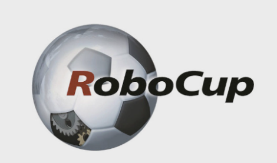
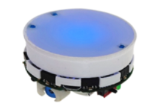

# RoboCup SSL: Simulation, Training, and Reinforcement Learning

This repository contains a comprehensive 2D simulation environment developed in MATLAB, inspired by the **RoboCup Small Size League (SSL)**. It serves as a unified testbed for evaluating decision-making strategies for autonomous mobile robots, ranging from deterministic Finite State Machines (FSM) to advanced Deep Reinforcement Learning (DRL) policies and multi-agent coordination.

  

## Overview of RoboCup and SSL
**RoboCup** is an international scientific initiative aimed at advancing the state of the art in intelligent robotics. The **Small Size League (SSL)** is one of its most dynamic divisions, focusing on highly reactive control and decision architectures. In SSL, two teams of small robots play soccer on a carpeted field. The perception of the game state is centralized: an overhead vision system tracks the robots and the ball, sending the coordinates to an off-field computer that processes the strategy and sends velocity commands back to the robots.

The simulator in this repository abstracts the core challenges of SSL:
- **Centralized Perception:** Global view of the field.
- **Highly Dynamic Environment:** Rapidly moving ball, unpredictable rebounds, and opponent interference.
- **Hierarchical Control:** Separation between high-level tactical decision-making and low-level kinematic control.

## The Physical Reference: Elisa-3 Bots

  

The simulation models the **Elisa-3** mobile robots. These are small-scale differential-drive robots. In our framework, they are mathematically abstracted using a unicycle kinematic model, which is then mapped to the differential-drive hardware using an **Input-Output Linearization** technique (controlling an advanced point $B$ on the chassis).

## Repository Structure & Projects Synthesis

This monorepo is divided into three main evolutionary stages of the project:

### 1. `1vs1_fsm` (Deterministic Baseline)
The foundational project. It implements a 1vs1 match where the robot's brain is a deterministic **Finite State Machine (FSM)**. The FSM evaluates the game state and fluidly switches between attacking, defending, and emergency clearing maneuvers. It serves as a robust, interpretable baseline for all subsequent developments.
👉 [Read more in `1vs1_fsm/README.md`](1vs1_fsm/README.md)

### 2. `1vs1_RL` (Reinforcement Learning)
In this project, the deterministic FSM is challenged and ultimately replaced by an AI trained via **Deep Q-Networks (DQN)**. The neural network operates at a macro-tactical level, learning to select the best high-level action. Through **Curriculum Learning** and **Reward Shaping**, we forged distinct "tactical styles" (e.g., hyper-offensive, defensive counter-attacker) that significantly outperform the standard FSM.
👉 [Read more in `1vs1_RL/README.md`](1vs1_RL/README.md)

### 3. `2vs2` (Multi-Agent Coordination)
This module scales the logic to a 2vs2 scenario. It introduces a hierarchical supervision layer (the `Coach`) that dynamically assigns roles (`leader` and `follower`) to teammates. It tackles multi-agent challenges such as spatial interference, coverage, and role swapping, complete with an interactive GUI to tune team tactics on the fly.
👉 [Read more in `2vs2/README.md`](2vs2/README.md)

---

## Setup and Dependencies
- **MATLAB:** Recommended version R2023a or newer.
- **Toolboxes:** 
  - Reinforcement Learning Toolbox (required for `1vs1_RL`)
  - Deep Learning Toolbox
  - Control System Toolbox
- **Running a simulation:** Navigate to any of the subfolders (`1vs1_fsm`, `1vs1_RL`, or `2vs2`) and run the respective main script (e.g., `Test.m` or `main_2vs2.m`).
